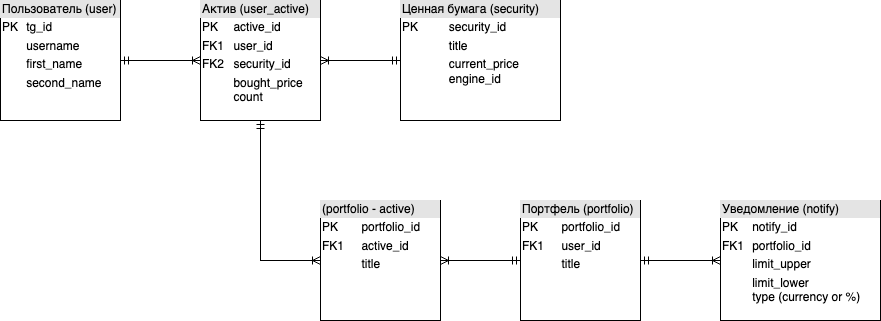

# bmstu-sem06-ppo

1. Stocks Tracker (Разработка системы мониторинга финансовых активов на основе данных Московской биржи)
2. Используя московскую биржу, забираем данные об актуальных данных и оповещаем пользователей об изменениях. Пользователь задает список интересующих акций и пороги. Взаимодейсвтвие через телеграм бота.
3. Предметная область: финансовые рынки. Мониторинг ценных бумаг и оповещение пользователей, если бумага стала дороже или дешевле установленного порога
4. Московская биржа имеет ручку, которая отдает поток данных
5. пользователь (задает ручки, получает уведомления)

## Пользовательские сценарии

Так же несколько сценариев использования:  
Сценарий 1: Выбор активов:  
  - Пользователь открывает телеграм-бот;  
  - Вводит команду для выбора интересующих активов (например, "/choose_assets");  
  - Получает список доступных активов и выбирает нужные (валюты, акции, облигации);  
  - Телеграм-бот подтверждает выбор активов.  
Сценарий 2: Настройка порогов:  
  - Пользователь вводит команду для установки порогов (например, "/set_thresholds");  
  - Выбирает ранее заданный актив и задает пороги в процентах или рублях;  
  - Телеграм-бот подтверждает установку порогов и сохраняет их в базе данных.  
Сценарий 3: Получение уведомлений:  
  - Система мониторинга отслеживает изменения курсов активов;  
  - При превышении заданных пользователем порогов, система отправляет уведомление через телеграм-бот;  
  - Пользователь получает уведомление с актуальной информацией о курсе и изменениях.

