# Разработка системы мониторинга финансовых активов на основе данных Московской биржи (Stocks Tracker)

## Описание

Используя московскую биржу, забираем данные об актуальных данных и оповещаем пользователей об изменениях. Пользователь задает список интересующих акций и пороги. Взаимодейсвтвие через телеграм бота.

### Предметная область

финансовые рынки. Мониторинг ценных бумаг и оповещение пользователей, если бумага стала дороже или дешевле установленного порога

### Пользовательские сценарии текстом

#### Выбор активов

- Пользователь открывает телеграм-бот;
- Вводит команду для добавления интересующих активов (например, "/add_active");
- Вводит ISIN (уникальный общепринятый ID актива), стоимость закупки и количество;
- Телеграм-бот подтверждает выбор активов и сохраняет их в базу данных.

#### Настройка уведомлений

- Пользователь вводит команду для установки уведомлений (например, "/add_notify");
- Выбирает ранее заданный актив и устанавливает пороги в абсолютном значении или в процентах;
- Телеграм-бот подтверждает установку порогов и сохраняет их в базе данных.
  
#### Получение уведомлений

- Система мониторинга отслеживает изменения курсов активов;
- При превышении заданных пользователем порогов, система отправляет уведомление через телеграм-бота;
- Пользователь получает уведомление с актуальной информацией о курсе и изменениях.

## Примеры запросов в мос биржу

1. [список ценных бумаг](https://iss.moex.com/iss/securities)
2. [ценная бумага](https://iss.moex.com/iss/securities/IMOEX)
3. [рынки](https://iss.moex.com/iss/engines)

## ER диаграмма

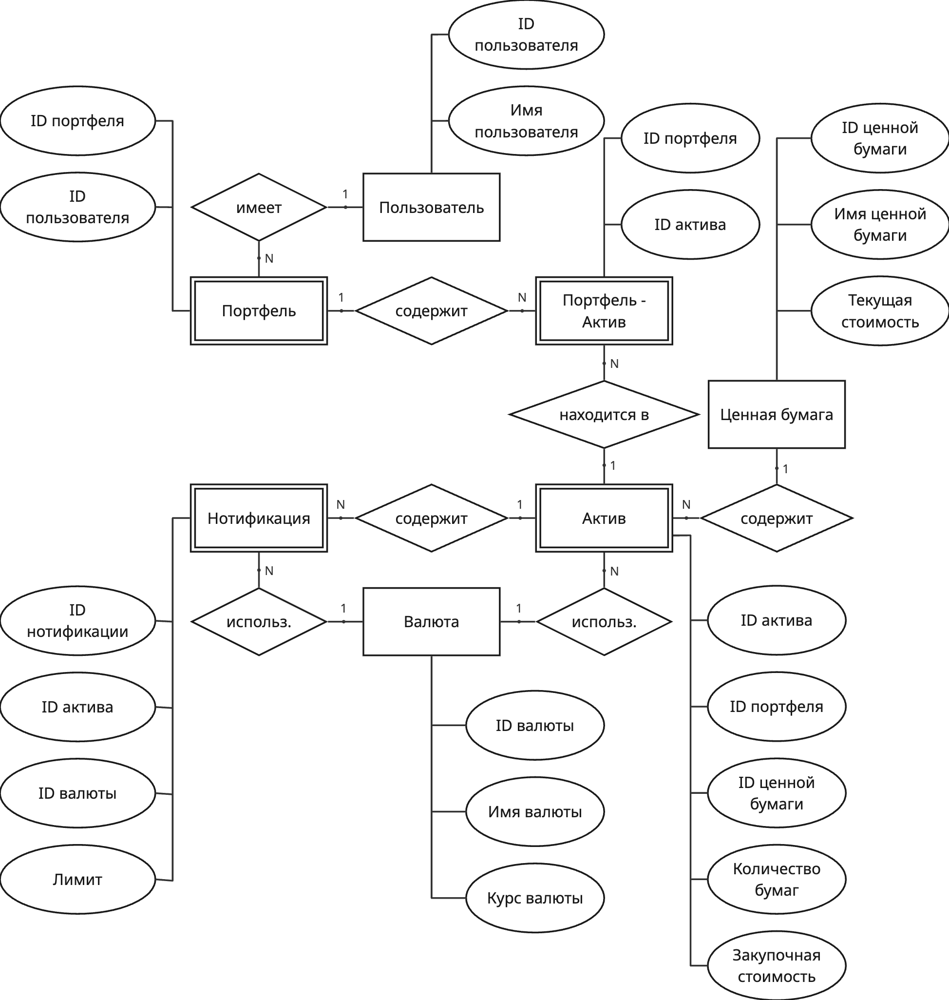

## Диаграмма БД

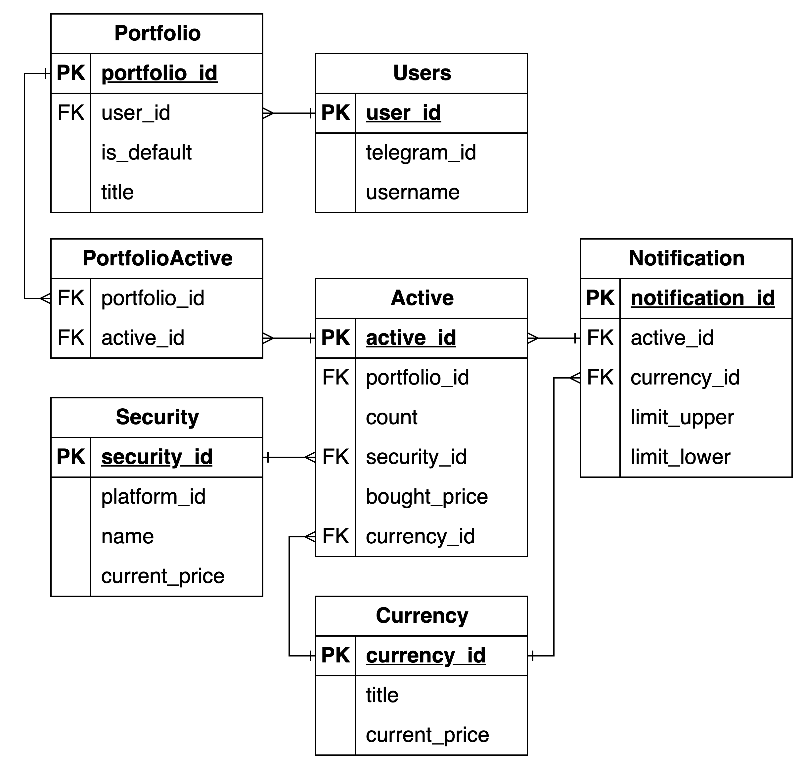

## Use cases

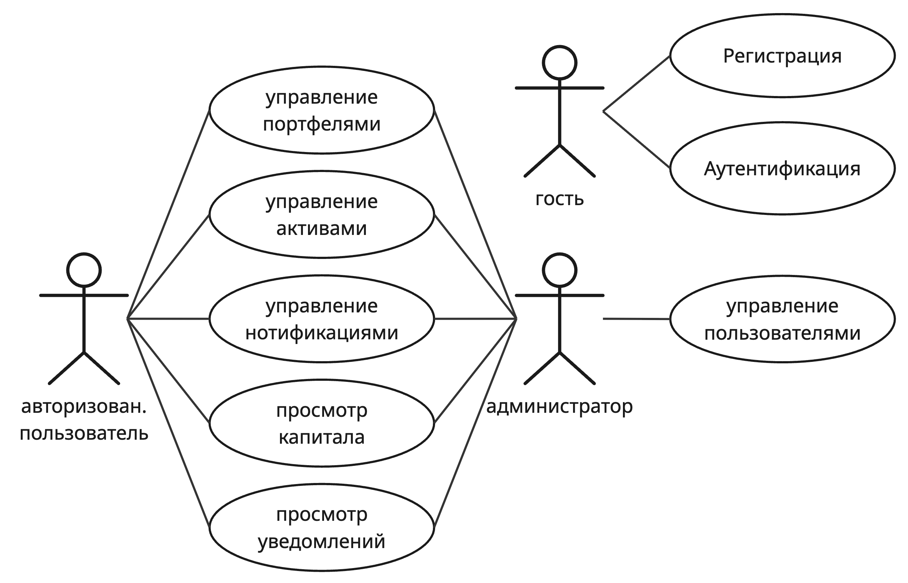

## BPMN

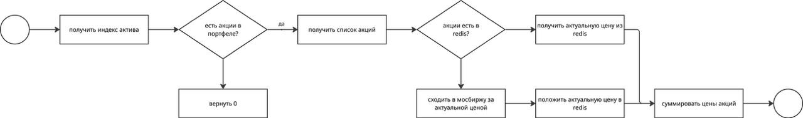

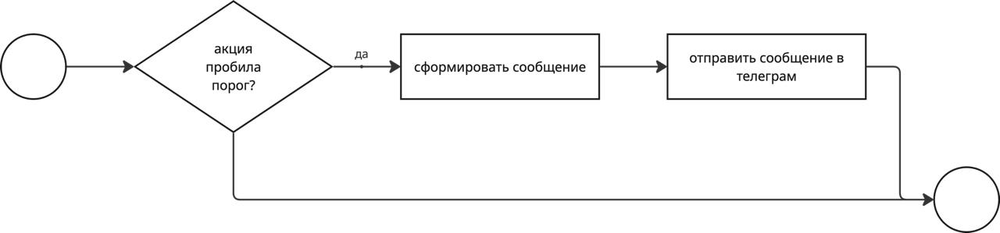

<!-- ### Активы

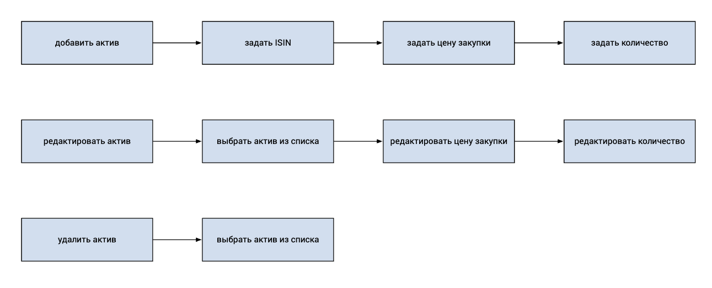

### Портфели

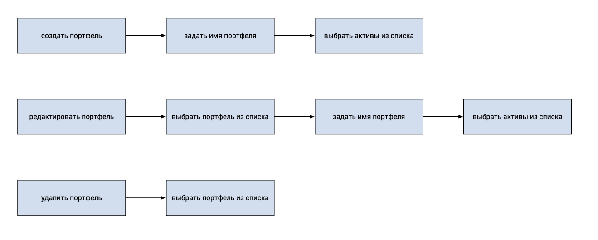

### Уведомления

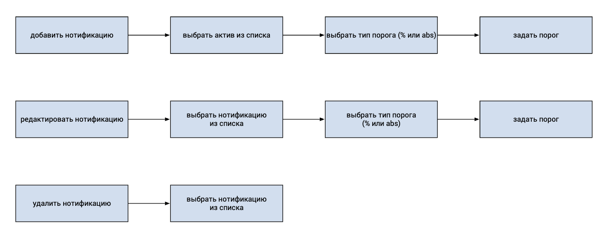

### Сложные

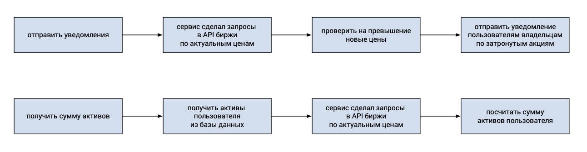 -->

### UML

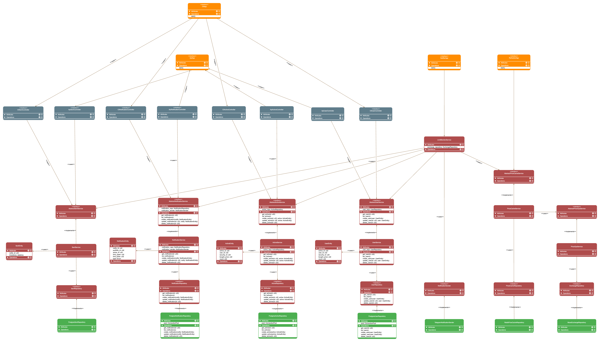

### Components

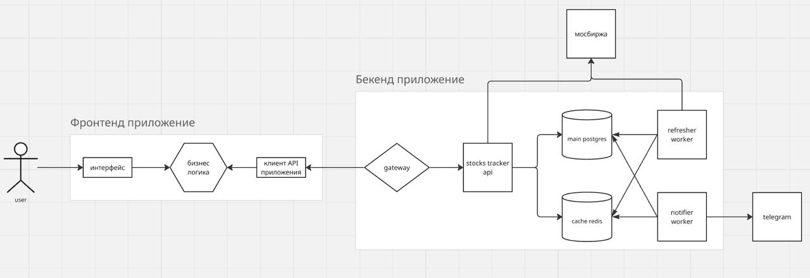

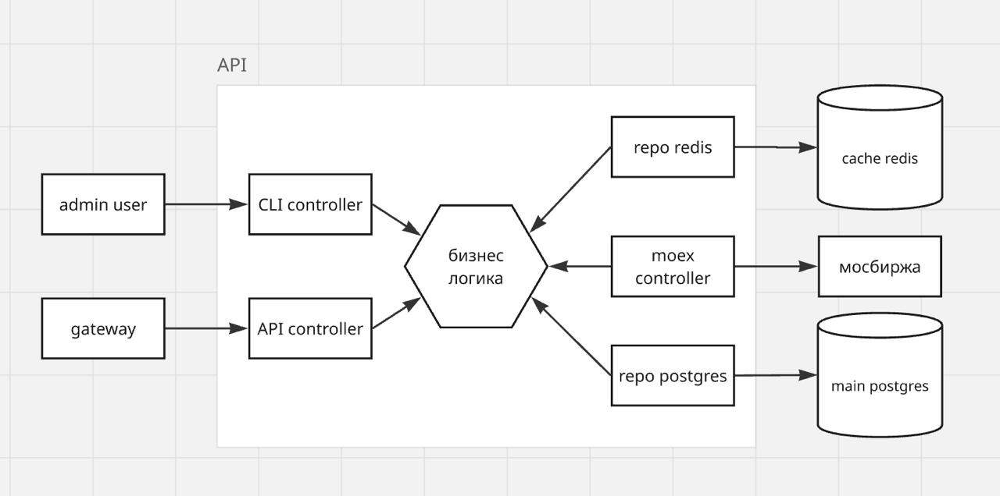

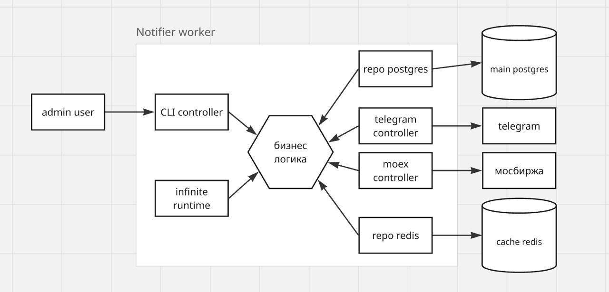

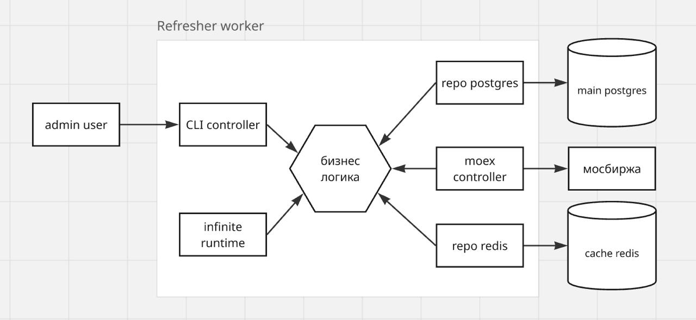

### Архитектура фронтэнд приложения

Стек:

- react -- библиотека для отрисовки компонентов
- redux -- стейт менедждмент
- vite -- сборка статики статики
- shadcn -- библиотека компонентов
- tailwind -- css библиотека, используется в shadcn
- storybook -- витрина компонентов для автоматического документирования
- nx -- структура, скрипты, генерация компонентов

В качестве архитектуры будет использоваться [FSD](https://feature-sliced.design/docs)

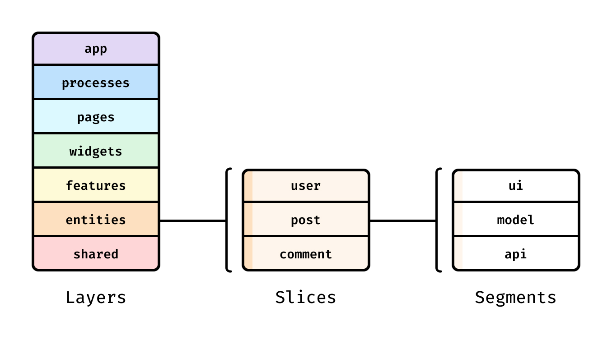

ссылка на [figma](https://www.figma.com/design/Xe40VmC8jc4humaiORuOx3/-shadcn-ui---Design-System--Community---Copy-?node-id=1103-995&t=hMLxsIYSduqq0UeS-1)

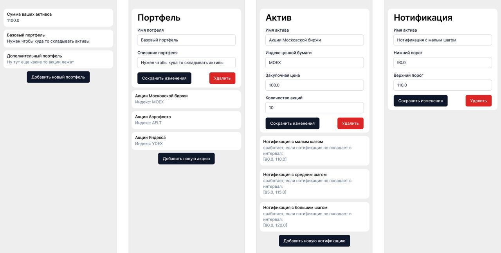

### Архитектура бекенд приложения

Стек:

- rust -- язык программирования
- axum -- REST фреймворк
- seaORM -- ORM для postgres
- redis -- библиотека для redis

Архитектура -- классическая чистая.

## Доработки

- документация сделать конвертацию md в html
- (?) доделать healthcheck
- настроить healthcheck на traefik
- добавить нагрузочное через CI
- настроить gzip на s3
- настроить репликацию базы данных
- настроить реплики API приложения через RO connection string (в учебных целях)
- вынести notifications table в отдельную БД. Вынести логику по управлению нотификациями в notifications-service
- вынести actives table в отдельную БД. Вынести логику по управлению активами в active-service.
