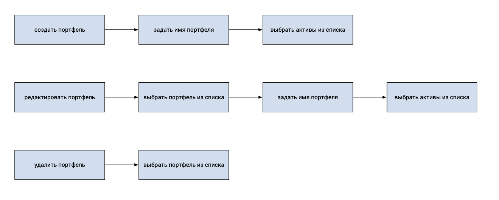

# Разработка системы мониторинга финансовых активов на основе данных Московской биржи (Stocks Tracker)

## Описание

Используя московскую биржу, забираем данные об актуальных данных и оповещаем пользователей об изменениях. Пользователь задает список интересующих акций и пороги. Взаимодейсвтвие через телеграм бота.

### Предметная область

финансовые рынки. Мониторинг ценных бумаг и оповещение пользователей, если бумага стала дороже или дешевле установленного порога

### Пользовательские сценарии текстом

#### Выбор активов

- Пользователь открывает телеграм-бот;
- Вводит команду для добавления интересующих активов (например, "/add_active");
- Вводит ISIN (уникальный общепринятый ID актива), стоимость закупки и количество;
- Телеграм-бот подтверждает выбор активов и сохраняет их в базу данных.

#### Настройка уведомлений

- Пользователь вводит команду для установки уведомлений (например, "/add_notify");
- Выбирает ранее заданный актив и устанавливает пороги в абсолютном значении или в процентах;
- Телеграм-бот подтверждает установку порогов и сохраняет их в базе данных.
  
#### Получение уведомлений

- Система мониторинга отслеживает изменения курсов активов;
- При превышении заданных пользователем порогов, система отправляет уведомление через телеграм-бота;
- Пользователь получает уведомление с актуальной информацией о курсе и изменениях.

## Примеры запросов в мос биржу

1. [список ценных бумаг](https://iss.moex.com/iss/securities)
2. [ценная бумага](https://iss.moex.com/iss/securities/IMOEX)
3. [рынки](https://iss.moex.com/iss/engines)

## Entity Relations диаграмма

## Use cases

### Активы

### Портфели

### Уведомления

### Сложные

